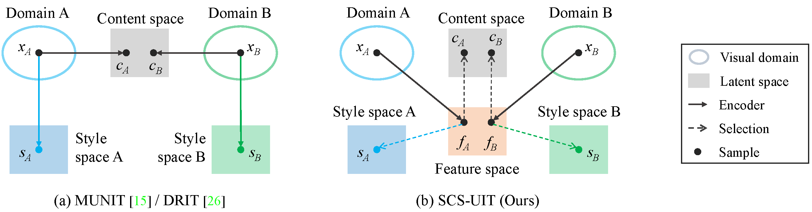
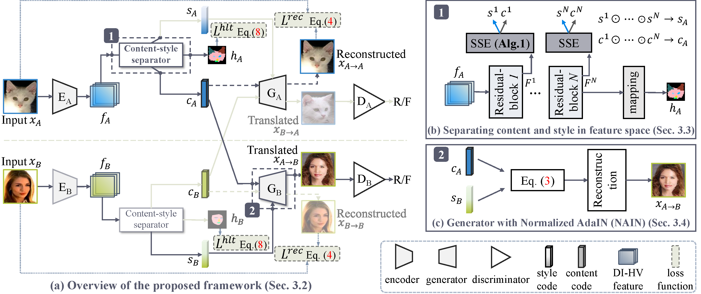
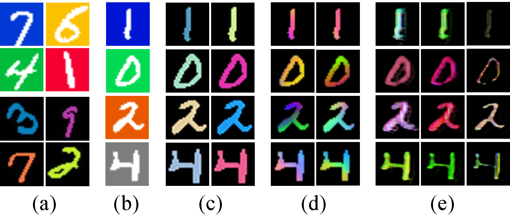
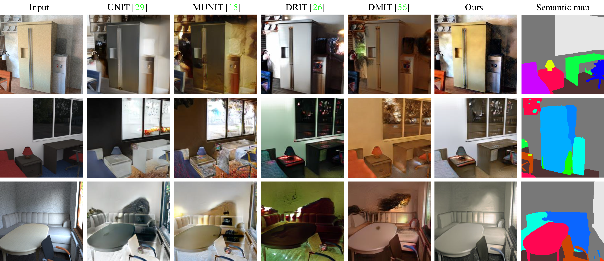

# Separating Content and Style in Unsupervised Image-to-Image Translation

> **Separating Content and Style in Unsupervised Image-to-Image Translation**
>
> **Abstract:**  Unsupervised image-to-image translation aims to learn the mapping between two visual domains with unpaired samples. The existing works often learn the domain-invariant content code and domain-specific style code individually using two encoders. However, this compromises the content and style representation, makes the content code focuses on trivial regions that are shared between domains (*e.g.*, background) and the style code focuses only on the global appearance. In this paper, we propose to extract and separate content code and style code within a single encoder based on the correlation between the latent features and the high-level domain-invariant tasks. This eases the interpretation and manipulation in image translation. Our experimental results demonstrate that the proposed method outperforms existing approaches in terms of visual quality and diversity, particularly on the challenging tasks that require different styles for different local objects. Code and results will be publicly available.

   

**Picture:**  *Comparisons of multi-modal unsupervised image-to-image translation methods. (a) MUNIT and DRIT decompose an image into a shared content code and a domain-specific style code through two independent encoders. (b) Our approach encodes image through a high-level task encoder, the content and style are disentangled based on the relevance to the high-level task.*

   

**Picture:**  *The proposed architecture.*

   

**Picture:**  Manipulation results on CG$\leftrightarrows$Real dataset.

   

**Picture:**  Manipulation results on ColoredMNIST dataset.

   

**Picture:**  Comparisons on the CG$\leftrightarrows$Real dataset. 

   

**Picture:**  Qualitative comparison on Cat$\leftrightarrows$Human.

## System requirements

* Only Linux is tested, Windows is under test.
* 64-bit Python 3.6 installation. 
* PyTorch 1.2.0 or newer with GPU support.
* One or more high-end NVIDIA GPUs with at least 8GB of DRAM.
* NVIDIA driver 391.35 or newer, CUDA toolkit 9.0 or newer, cuDNN 7.3.1 or newer.
* 
